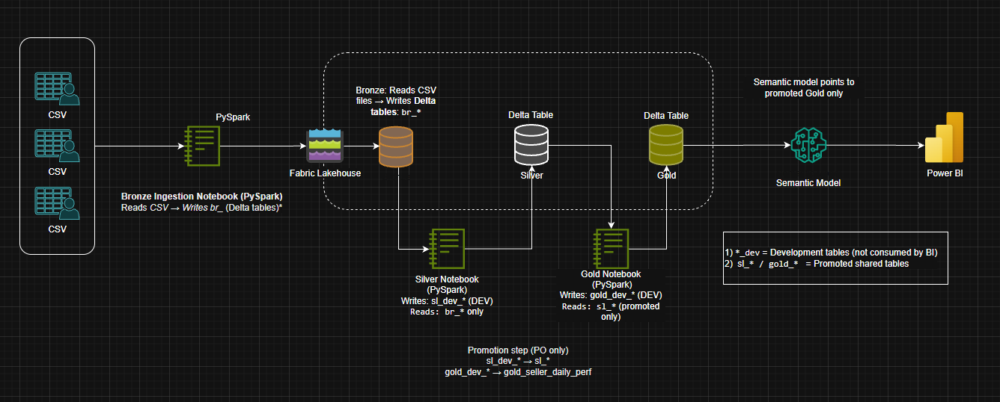

# JDE_Midjoiners Olist Final Project

## Fabric Medallion Analytics Pipeline:

End‑to‑end seller ETL and analytics project executed in Microsoft Fabric only

## ETL Architecture with Analytics:

Bronze → Silver → Gold → Semantic Model → Power BI medallion architecture.

End‑to‑end seller analytics project on Microsoft Fabric, implementing a \*\*Bronze → Silver → Gold → Semantic Model → Power BI\*\* medallion architecture

## Architecture Diagram 

### Pipeline Architecture Sprint 1

### Pipeline Architecture Sprint 2

## Overview: 

This repository contains the Sprint 1 and Sprint 2 implementation of the Olist JDE Final Project which aims to address this main problem statement:

Olist lacks a unified view of seller performance that connects sales outcomes, delivery performance, customer reviews, product categories.

This project aims to integrate multiple datasets to evaluate seller performance and delivery timings, enabling informed decisions related to:
- Total seller sale orders 
- Delivery improvement times 

Two sprints:  

### Sprint 1:

* Single Fabric Lakehouse
* logically separated layers
* fast delivery 
* validated Gold outputs for single grain: No of orders sellers sold in a day

### Sprint 2: 

* Physically separated Bronze/Silver/Gold lakehouses
* Shortcut-based connectivity to connect layers, allowing for downstream layers to read upstream data directly without physical duplication and excess storage
* Governed fact–dimension galaxy schema in Gold
* BI semantic model reads only from promoted Gold tables 

## Architecture \& governance

Data flows from CSV/API extract into Bronze, then through Silver and Gold, into a curated semantic model and Power BI reports; BI reads \*\*Gold only\*\* (no joins to Silver/Bronze). 

Clear layer responsibilities: Bronze for raw ingestion, Silver for cleaning and grain enforcement, Gold for business KPIs and analytics‑ready modelling. 
All lakehouses were created in the same workspace as the original shared lakehouse to simplify lineage tracking, controlled baseline migration, and validation.

Promotion model with dev vs promoted tables, PO approval, and “virtual” Gold promotion in Sprint 2 after BI validation. 

### Bronze Layer 

* Raw data ingestion
* All columns ingested as STRING
* No cleaning or interpretation
* Raw data ingestion
* All columns ingested as STRING
* No cleaning or interpretation

### Silver Layer 
* Data preparation and standardization
* Data type ownership
* Grain enforcement and deduplication
* Safe foundation for aggregation

### Gold Layer
* Business logic and KPI computation
* Fact and dimension modelling focused on a primary grain: No of orders sellers sold in a day 
* Business measures are defined in the BI semantic model using Gold facts and dimensions as governed inputs.
* Sprint 2 Gold intentionally excludes order-level entities such as payments and reviews from seller-level facts to preserve grain correctness and aggregation safety.

## Report Generated 
* Order Spike on One Day Only - Black Friday
* Average Delivery Duration
* Total Delivered Orders by Seller
* Deliveries on Time vs Late Deliveries 
* Total Orders by Date   

## Outcomes
* Successfully implemented end to end ETL solely in Microsoft Fabric with Power BI 
* Built a Medallion Lakehouse architecture on OneLake 
* Executed dimensional modelling, galaxy schema design of facts and dimensions 
* Business-ready KPIs for analytics in Power BI 
